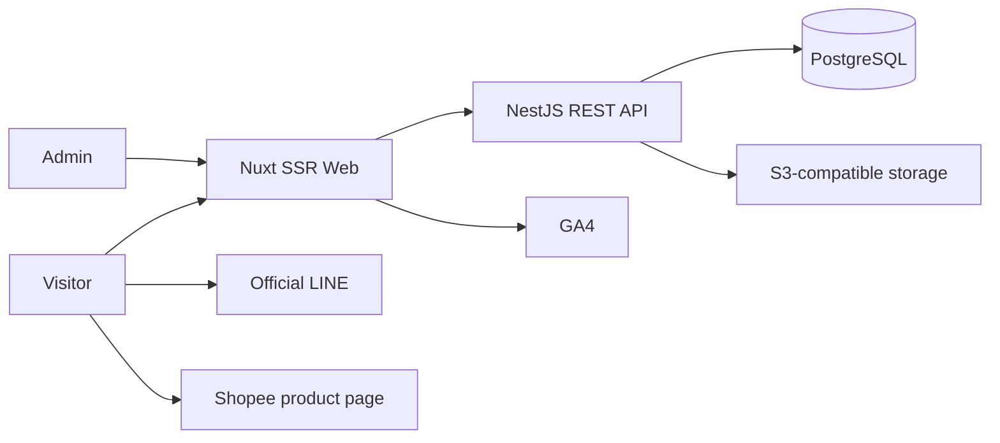

# Architecture

Requirements: `FR-001`–`FR-014`, with the data minimization invariant `BR-001`.

Public response DTOs are separate from admin DTOs so `BR-001` is enforced server-side. Deployment adapters keep compute, database, and storage provider-neutral.
