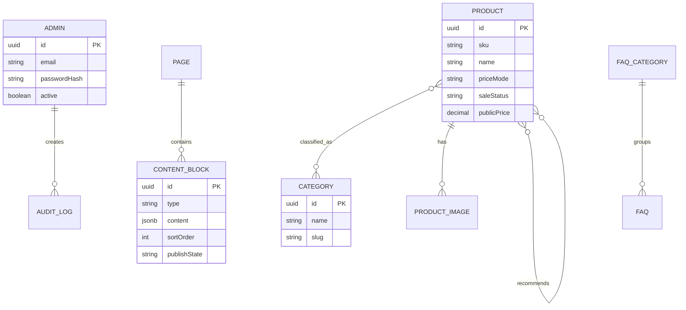

# Data Model

Supports `FR-002`–`FR-010`.

## Implementation

- Prisma schema: `apps/api/prisma/schema.prisma`
- Initial migration: `apps/api/prisma/migrations/20260715000100_initial_schema/migration.sql`
- Runtime adapter: `apps/api/src/database/prisma.service.ts`

Explicit join tables preserve relationship metadata and ordering. JSONB is limited to schema-driven content, specifications, FAQ rich text, settings, and audit metadata. Product visibility and public-price projection remain application-level invariants referenced by `BR-001`–`BR-005`; database checks enforce price validity, Shopee URL consistency, non-self recommendations, valid carousel windows, and one primary image per product.

`ProductImage` is a one-to-many child of `Product`, so a product may own multiple images. Each image stores its object key, verified MIME type, byte size, dimensions, display order, alternative text, and primary-image flag. The first uploaded image becomes primary when the product has no images; administrators may later reorder images or select another primary image.

Local development stores uploaded files under `apps/api/uploads/products`, which Git excludes. The isolated storage service can be replaced by production object storage without changing product business rules or the HTTP contract.
