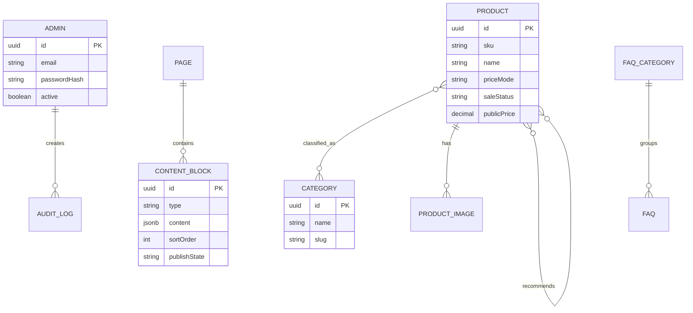

# Data Model

Supports `FR-002`–`FR-010`.

```mermaid
erDiagram
  ADMIN ||--o{ AUDIT_LOG : creates
  PRODUCT }o--o{ CATEGORY : classified_as
  PRODUCT ||--o{ PRODUCT_IMAGE : has
  PRODUCT }o--o{ PRODUCT : recommends
  PAGE ||--o{ CONTENT_BLOCK : contains
  FAQ_CATEGORY ||--o{ FAQ : groups
  ADMIN { uuid id PK string email string passwordHash boolean active }
  PRODUCT { uuid id PK string sku string name string priceMode string saleStatus decimal publicPrice }
  CATEGORY { uuid id PK string name string slug }
  CONTENT_BLOCK { uuid id PK string type jsonb content int sortOrder string publishState }
```
