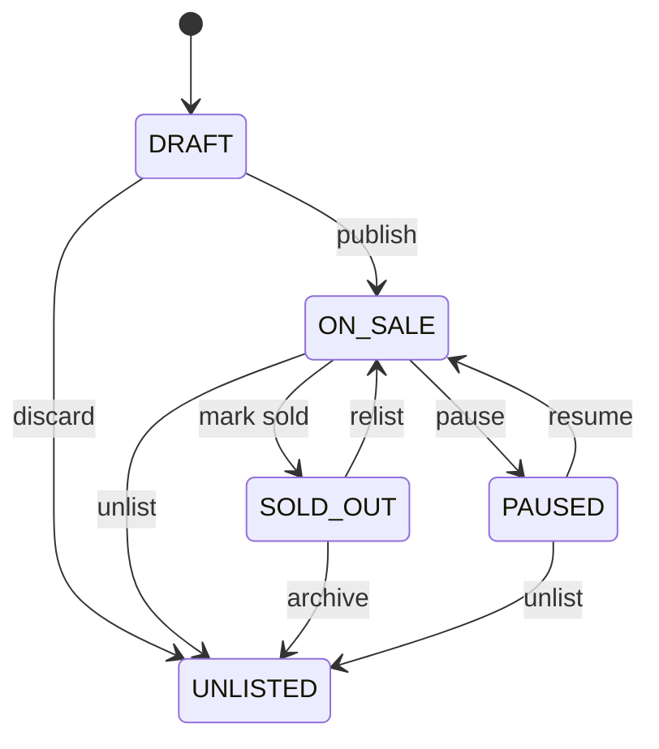

# System Analysis — Full Track

> 本文件是需求唯一正本。來源：龍振藝品網站需求說明書 V0.2（2026-07-14）。

## Roles

| Role | Description |
|---|---|
| Visitor | 瀏覽內容、搜尋商品、前往蝦皮或 LINE |
| Administrator | 使用獨立帳號管理所有網站內容，管理員間權限相同 |

## Functional requirements

- `FR-001` 提供響應式品牌首頁、全站導覽、Footer 與 404。
- `FR-002` 提供受控版型的龍宮舍利區塊內容編輯、草稿、預覽與發布。
- `FR-003` 提供商品多分類、搜尋、篩選、排序及分頁。
- `FR-004` 提供商品詳情、圖庫、規格、標籤、分享與推薦商品。
- `FR-005` 依商品設定公開價格、LINE 詢價或完全不公開價格。
- `FR-006` 依商品設定蝦皮連結、LINE 詢問文字、複製與 QR Code 導流。
- `FR-007` 管理輪播、首頁區塊、FAQ、聯絡資訊與全站設定。
- `FR-008` 至少支援三個相同權限的獨立管理員帳號、停用、重設密碼與登入紀錄。
- `FR-009` 記錄管理員重要操作，並提供失敗限制與閒置登出。
- `FR-010` 管理圖片上傳、多圖排序、格式與大小限制。
- `FR-011` 提供頁面、分類及商品 SEO、sitemap、canonical、Open Graph 與結構化資料。
- `FR-012` 追蹤 RFP 指定 GA4 事件，但不得傳送非公開價格或敏感資料。
- `FR-013` 提供資料庫與檔案備份、還原及部署文件。
- `FR-014` 所有列表與 API 支援分頁，不得依固定商品數量設計。

## State cases

- `CASE-001` `DRAFT`：僅後台可見。
- `CASE-002` `ON_SALE`：前台可見，依設定提供蝦皮或 LINE。
- `CASE-003` `SOLD_OUT`：可保留展示，關閉購買並推薦相似商品。
- `CASE-004` `PAUSED`：可保留展示但不可購買。
- `CASE-005` `UNLISTED`：前台完全不可見。

## Business rules

- `BR-001` 非公開價格不得出現在 HTML、SSR payload、前台 API、搜尋索引、GA、structured data、client state 或 log。
- `BR-002` `DRAFT`、`UNLISTED` 商品不得出現在任何前台查詢結果。
- `BR-003` 未公開價格商品不參與價格排序，並排在公開價格商品後。
- `BR-004` 分類仍關聯商品時禁止刪除。
- `BR-005` 推薦順序為人工指定、同分類、其他推薦上架商品。
- `BR-006` LINE 無法可靠預填時，必須顯示正確詢問文字、支援複製，再開啟 LINE。
- `BR-007` 草稿內容不得出現在正式網站。
- `BR-008` 管理員不得共用帳號。

## Core field specification

| Field | Required | Type | Description |
|---|---:|---|---|
| product.name | yes | string | 商品名稱 |
| product.sku | yes | string unique | 商品編號 |
| product.categoryIds | yes | uuid[] | 多分類關聯 |
| product.priceMode | yes | enum | PUBLIC_PRICE / LINE_OFFER / CONTACT_PRICE |
| product.saleStatus | yes | enum | CASE-001～CASE-005 |
| product.publicPrice | conditional | decimal | 僅 PUBLIC_PRICE 對外輸出 |
| product.shopeeUrl | no | url | 個別商品連結 |
| product.acceptsLine | yes | boolean | 是否接受 LINE 詢問 |
| product.images | no | image[] | 可上傳多張商品圖片，並指定排序與主圖 |

## Acceptance

- `UAT-001` 對應 `FR-001`：主要頁面及桌機、平板、手機導覽正常。
- `UAT-002` 對應 `FR-002`：區塊可新增、複製、排序、隱藏、草稿、預覽與發布。
- `UAT-003` 對應 `FR-003`、`FR-014`：商品搜尋、分類、篩選、排序及分頁正確。
- `UAT-004` 對應 `FR-005`：所有非公開價格通道均符合 `BR-001`。
- `UAT-005` 對應 `FR-006`：蝦皮與 LINE 使用個別商品資料並具 fallback 流程。
- `UAT-006` 對應 `FR-008`、`FR-009`：三個獨立管理員可登入且重要操作可追溯。
- `UAT-007` 對應 `FR-011`、`FR-012`：SEO 與 GA4 事件正確且不洩漏敏感資料。
- `UAT-008` 對應 `FR-013`：備份可依文件完成還原驗證。

## Pending owner decisions

- 正式網域、主機與部署平台。
- 商品分類實際名稱及層級。
- 品牌 Logo、正式文案、圖片及影片。
- 圖片格式、尺寸及單檔容量上限。
- 售完商品預設是否保留 LINE 詢問。
- Cookie 提示依實際營運地區的法律意見。

## Phase 2

- `EXT-001` 前台會員。
- `EXT-002` 購物車與站內結帳。
- `EXT-003` 金流、訂單、庫存、物流與發票。
- `EXT-004` 多語系。
- `EXT-005` LINE 聊天機器人或訊息預填整合。
- `EXT-006` GA 報表後台。
- `EXT-007` 細部角色權限。
- `EXT-008` 線上聯絡表單。
- `EXT-009` 即時客服。

## RFP coverage appendix

| RFP | Mapping | Status |
|---|---|---|
| §1–4 | FR-001～FR-014, EXT-001～EXT-009 | covered |
| §5–17 | FR-001～FR-012, BR-001～BR-008 | covered |
| §18–20 | FR-013, pending decisions | partial/pending |
| §21 | UAT-001～UAT-008 | covered |
| §22–24 | deliverables and pending decisions | covered |
